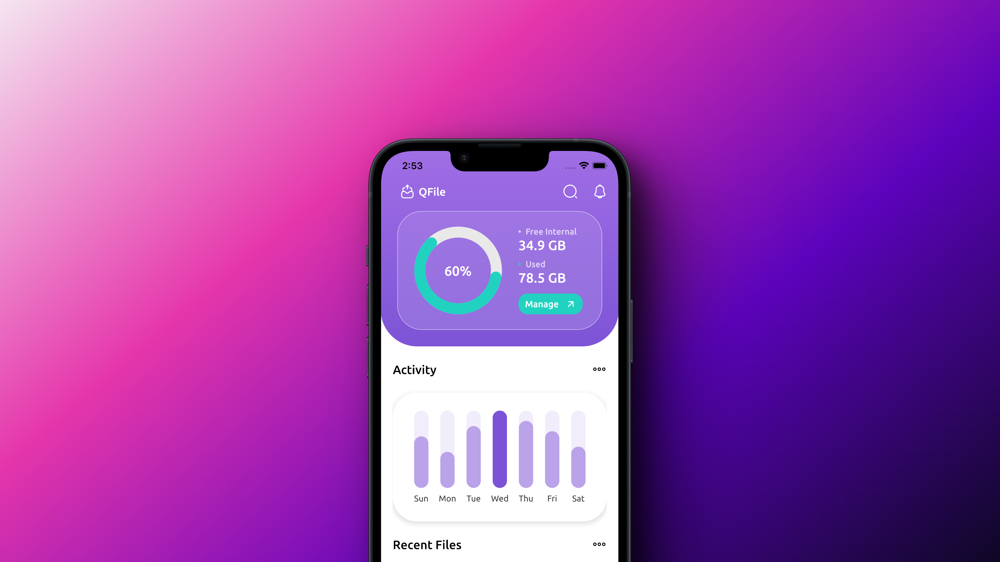
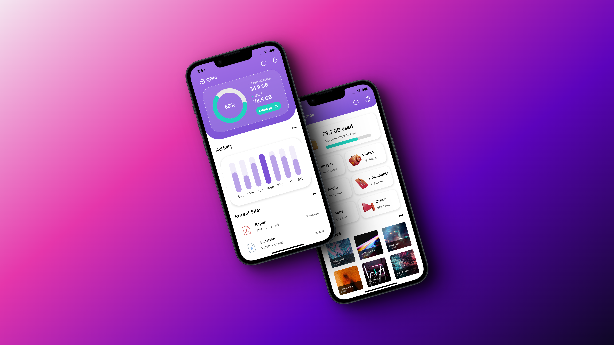
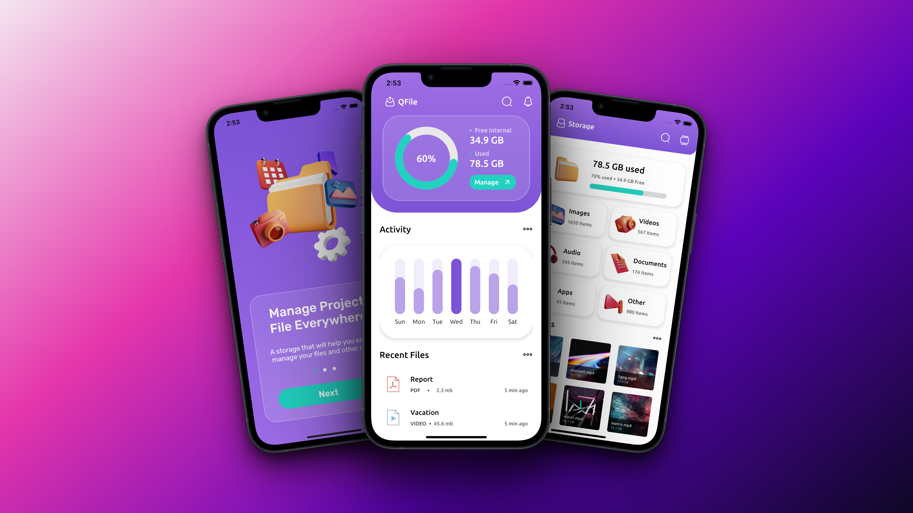
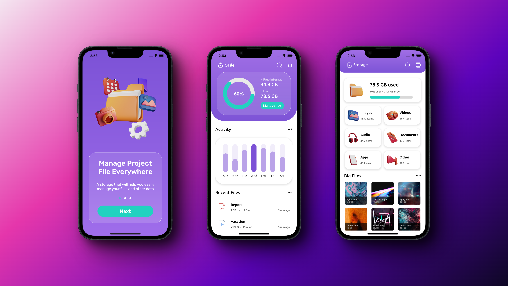

⚡ Flutter Mobile Storage Manager App (Backendless).

Technologies: 
  - Language: Dart 
  - Framework: Flutter 
  - Platform: Android & iOS 
  - State management: Riverpod 
  
  This portfolio object showcases my development skills in creating a Mobile Storage Manager App using Flutter, based on a design found on Behance. The app aims to provide users with an efficient and user-friendly interface to manage their storage without relying on a traditional backend.  
  By leveraging the power of Flutter, I developed an app that seamlessly integrates with various storage platforms and allows users to organize, browse, and manage their files and folders effectively. The app utilizes Flutter's rich widget library, ensuring a visually appealing and intuitive user experience.  
  By developing this Mobile Storage Manager App without relying on a backend, I demonstrate my proficiency in leveraging Flutter's capabilities to create efficient and standalone applications. This project serves as a testament to my expertise in Flutter app development and showcases my ability to transform a design concept into a fully functional and visually appealing mobile application.
